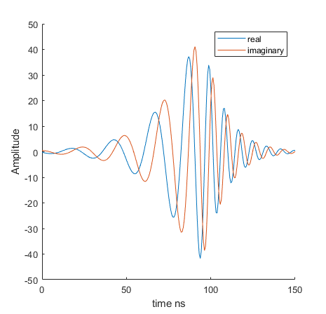

#PusleShape

PulseShape is an EasySpin `pulse` function clone written in python. The major purpose for 
rewriting pulse in Python is to free the function from the proprietary MATLAB universe and 
make it easier to use on linux systems that often ship with e580 spectrometers. 

The PulseShape is built around the `Pulse` object which accepts arguments similar to those 
used by the easyspin `pulse` function. 

## Example: sech\tanh pulse with resonator compensation
<table>
<tr>
<th>PulseShape</th>
<th>EasySpin</th>
</tr>
<tr>
<td>

```python
import numpy as np
import matplotlib.pyplot as plt
from PulseShape import Pulse

profile = np.loadtxt('data/Transferfunction.dat')
pulse = Pulse(pulse_time=0.150, 
              time_step=0.000625, 
              flip=np.pi, 
              freq=[40, 120], 
              type='sech/tanh', 
              beta=10, 
              profile=profile)

plt.figure(figsize=(5, 5))
plt.plot(pulse.time * 1000, pulse.IQ.real, label='real')
plt.plot(pulse.time * 1000, pulse.IQ.imag, label='imaginary')
plt.xlabel('time (ns)')
plt.ylabel('Amplitude')
plt.legend()
plt.show()
```


</td>
<td>

```matlab
Par = struct
Par.Type = 'sech/tanh';
Par.beta = 10;
Par.tp = 0.150;
Par.Phase = 0;
Par.Flip = pi;
Par.Frequency = [40 120]
Par.TimeStep=0.000625

filename = 'Transferfunction.dat';
delimiter = ' ';
formatSpec = '%f%f%[^\n\r]';
fileID = fopen(filename,'r');
dataArray = textscan(fileID, formatSpec, 'Delimiter', ... 
    delimiter, 'MultipleDelimsAsOne', true, 'TextType', 'string');
fclose(fileID);

xresponse = dataArray{:, 1};
yresponse = dataArray{:, 2};

Par.FrequencyResponse = [xresponse,yresponse];

[t, IQ] = pulse(Par)
[t, IQ, modulation] = pulse(Par) 

figure(1)
hold on
plot(t, real(IQ))
plot(t, imag(IQ))
xlabel('time ns')
ylabel('Amplitude')
x0=10;
y0=10;
width=465;
height=448;
set(gcf,'position',[x0,y0,width,height])

```

</td>
</tr>
</table>